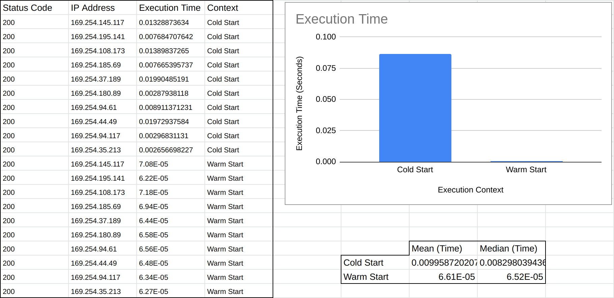
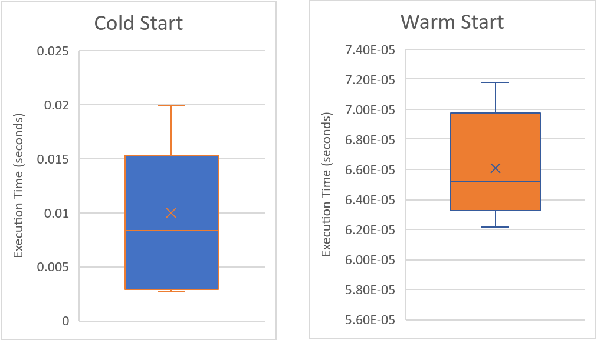

# Task-2
The second task is to find out the time it takes for your Task-1 code to run during “cold starts” / “warm starts”. A “cold start” is when AWS Lambda is forced to spin up a new Execution Context in order to process a requested function invocation. A “warm start” is when AWS Lambda makes use of an already pre-existing Execution context for a requested invocation. There will be a measurable timing difference between the two modes. Your goal is to measure the response time of an AWS Lambda function after at least 10 cold starts and at least 10 warm starts and then compare the two categories of times.

#### Hints:
1. For a cold start, you can make slight changes to your Task-1 code, re-deploy it and then do the first function invocation with the help of some simple time measurement set-up on your client machine. Make sure that you do not use the “Test” feature provided on AWS GUI as this will end up invoking your function and might lead to a warm start instead of a cold start”. You can continue to make such slight changes for more cold starts.
2. For a warm start, you can first make a cold start as above and then make a series of invocations to the same cold-started function and measure the response times. 

## Deliverables
1. Describe the process you used for setting up cold and warm starts. Please include any code /commands you used for this.
    - I manually redeployed the function handler code in the AWS Console each time I wanted a cold start which forced the Lambda function to use a new execution context, thus forcing a cold start. I then invoked the Lambda fuction twice (one for cold start data and one for warm start) and repeated this process for a total of ten times to acquire 10 cold and warm start points of data.

2. Show the raw results of response time for all the cold starts and warm starts and their mean and median values.
    - Pure results are in the [results.xlsx](results.xlsx) file. Below is a preview of the data.
<p align="center"></p>

3. Draw a box plot graph depicting the cold and warm start response times. You may use Excel / Matplotlib or any other suitable tool for this. Please submit additional code (if any) for this.
<p align="center"></p>

## Guide
#### Infrastructure
Creates a default Lambda function for quick testing and deletes once user is done.
```
python3 lambda_task_2.py
```

#### Lambda Invocation
Invokes the created Lambda function with a default message and appends response to response.txt.
```
./invoke.sh
```
